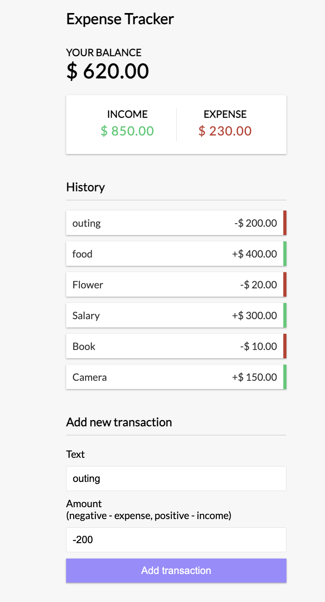
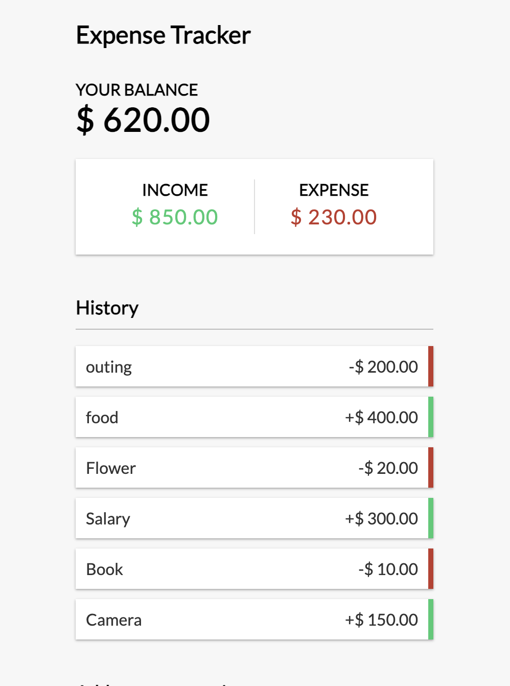
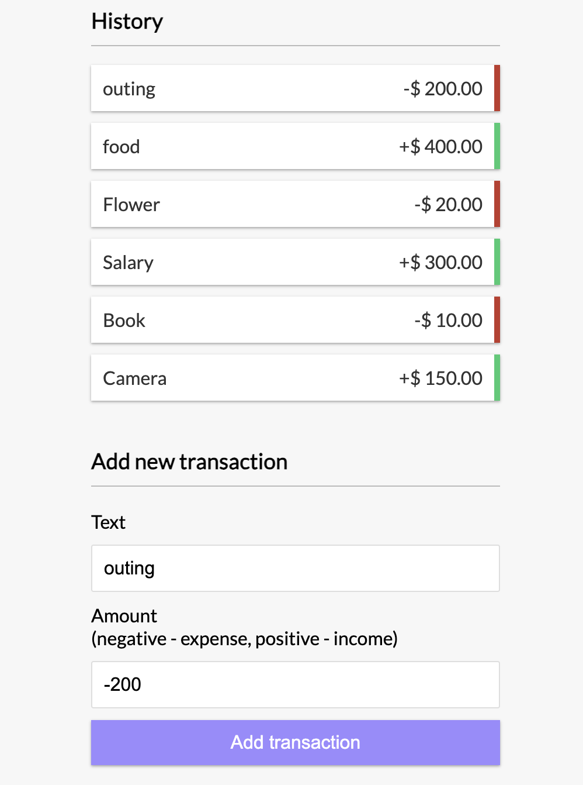

#Expense Tracker
Expense Tracker is a simple web application built to help users track their expenses and income. It allows users to add, delete, and view their transactions, providing a clear overview of their financial activities.

#Features
Transaction Management: Add new transactions, including details like description and amount. Delete transactions as needed.

Transaction History: View a list of all transactions, including descriptions, amounts, and whether they represent income or expenses.

Balance Calculation: Track your balance in real-time, showing the total amount of your income and expenses.

#Screenshots 

